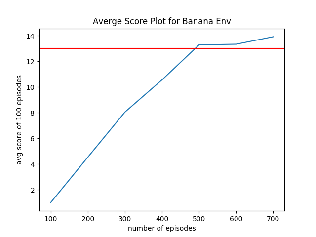

# Banana Navigation

### Description 

This repository contains the code to train the reinforcement learning agent to navigate in the banana world. It uses value based method and 3 layer neural network to model the agent. The code base is written in python and pytorch. 

### State Description 

The state space has 37 dimensions and contains the agent's velocity, along with ray-based perception of objects around agent's forward direction.  Given this information, the agent has to learn how to best select actions.  Four discrete actions are available, corresponding to:
- **`0`** - move forward.
- **`1`** - move backward.
- **`2`** - turn left.
- **`3`** - turn right.

### Instruction:
1. Download the environment from [this link](https://s3-us-west-1.amazonaws.com/udacity-drlnd/P1/Banana/Banana_Linux_NoVis.zip)
2. Fix the env path in `main.py`
3. Run 
    ```sh  
    $ python main.py
    ```
4. optionally run `create_plot.py` to create the reward plot.

### Result
- The environment can be solved within about 600 episode using the following parameters. 
    - max_t=1000, 
    - eps_start=1.0, 
    - eps_end=0.01, 
    - eps_decay=0.995
- Epsilon greedy policy has been used. 
- Prioritized experience replay has beed applied in training.
- Score plot: 


