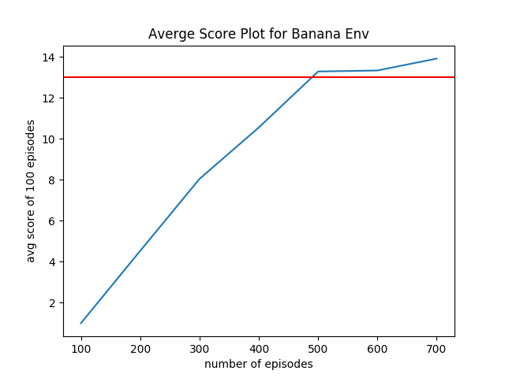

# Banana Navigation

### Learning Algorithm
- DQN style value based method
- optimal action-value function estimator: neural network
    - NN architecture: 
        - 3 layer with relu non linearity
        - outputs a vector containing Q value for all actions
    - temporal difference learning
        - hyper paramters
        ```
        BATCH_SIZE = 64  # minibatch size
        GAMMA = 0.99  # discount factor
        ```
    - update rule: soft update with tau 1e-3 
        - create two network and backpropagate only on the main network
        - update the target network using the weighted average of the main and target.
        ```
        TAU = 1e-3  # for soft update of target parameters
        ```
    - Prioritized experince replay: create a replay buffer to sample less correlated dataset
        - hyper paremters 
        ```angular2
        UPDATE_EVERY = 4  # how often to update the network
        BUFFER_SIZE = int(1e5)  # replay buffer size
        ```
    - optimization:
        - mse loss
        ```
        LR = 5e-4  # learning rate
        ```
- policy: epsilon greedy policy 
    - hyper parameters:
        ```
        - eps_start=1.0, 
        - eps_end=0.01, 
        - eps_decay=0.995
        ```
- input space: 
    - 37 dimensions and contains the agent's velocity, along with ray-based perception of objects around agent's forward direction
    - continuous
- action space: 
    - 4 discrete

### Plot of Rewards
The average of 100 episode score exceeds 13 after 500 episodes. 


### Ideas for Future Work
- Double DQN (DDQN) or Dueling DQN is known to improve the convergence speed. 
- Or implement the paper Rainbow: Combining Improvements in Deep Reinforcement Learning
 